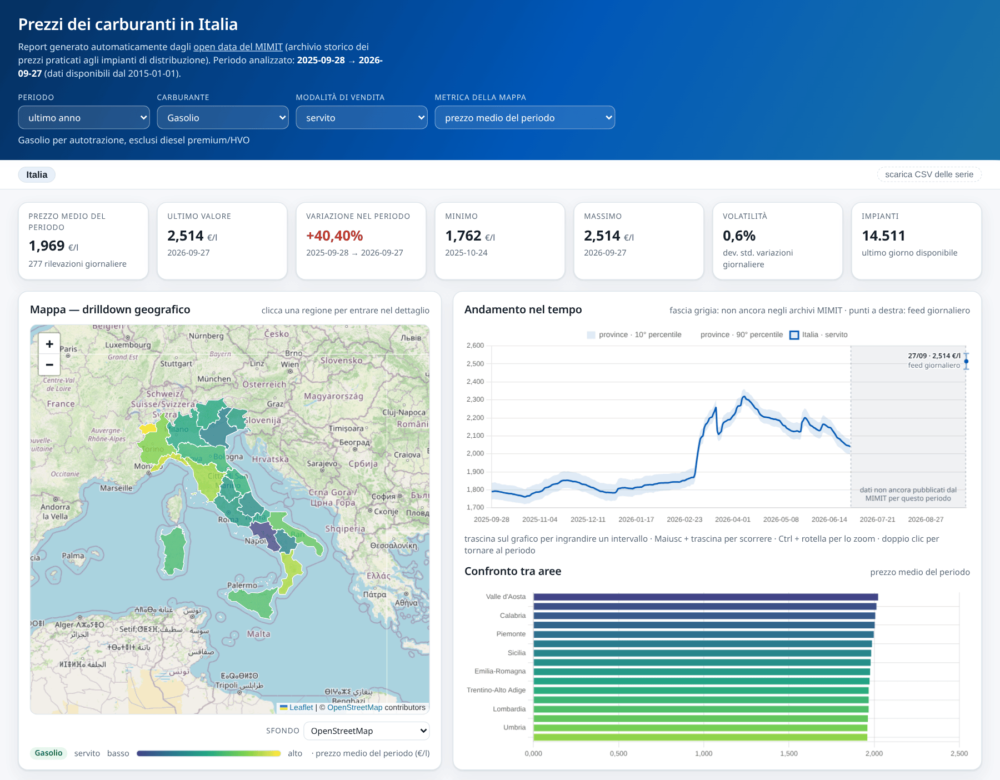
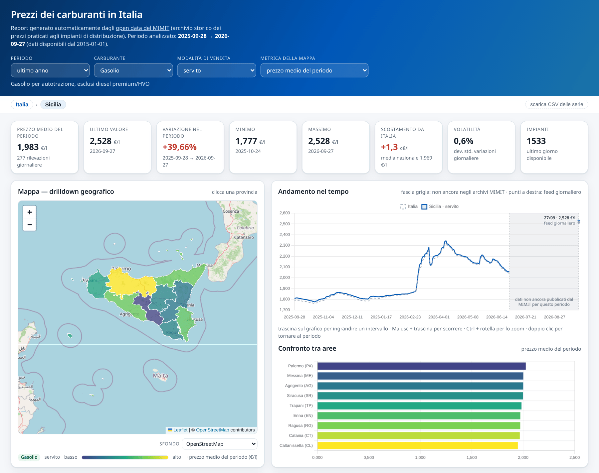
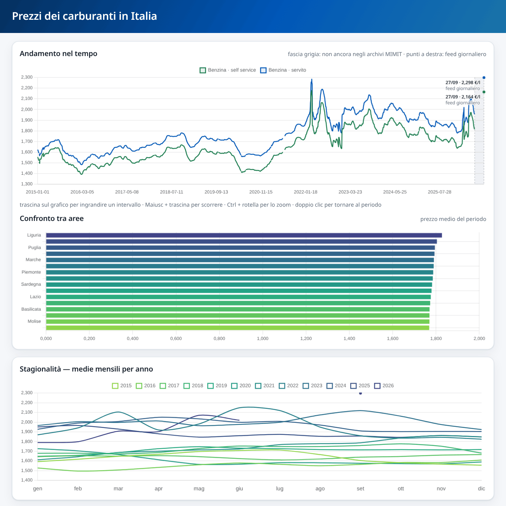
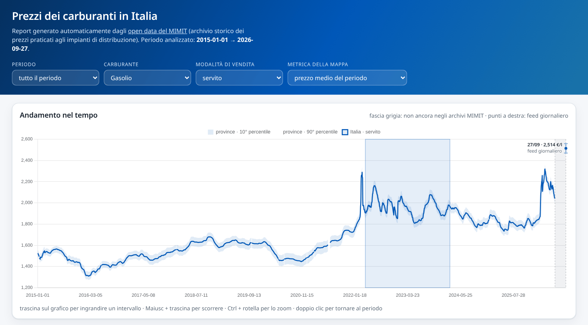
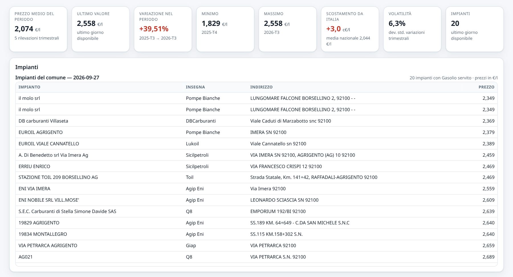
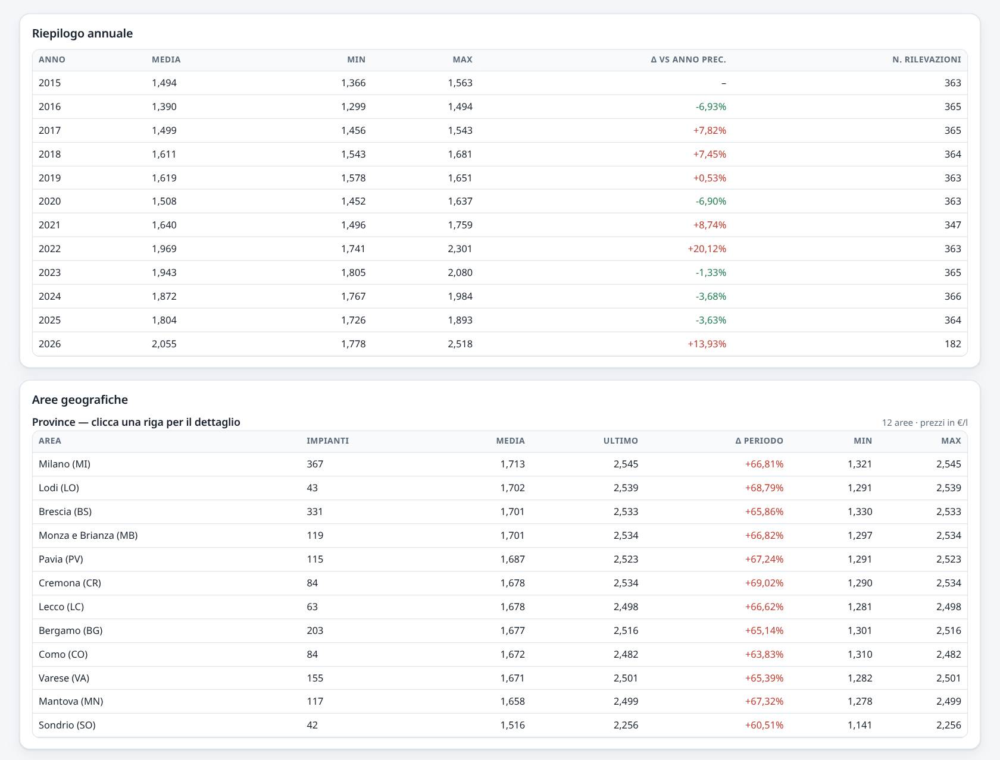

# Report prezzi carburanti — open data MIMIT + mappa OpenStreetMap

Tool da riga di comando che scarica gli **open data del MIMIT** (Ministero delle Imprese e
del Made in Italy) sui prezzi dei carburanti e genera un **report HTML interattivo** con:

* statistiche degli andamenti nel tempo (nazionale, per regione, provincia e comune);
* **mappa OpenStreetMap cliccabile con drilldown**: Italia → regioni → province → comuni → impianti;
* grafici (andamento, confronto tra aree, stagionalità, distribuzione) e tabelle ordinabili.

Report online con la serie storica dal 2015, aggiornato ogni giorno alle 10:
<https://tzulux.github.io/FuelReport>

Fonti dati (open data MIMIT):

* archivio storico trimestrale: <https://www.mimit.gov.it/it/open-data/elenco-dataset/carburanti-archivio-prezzi>
* prezzi e anagrafica del giorno (feed giornaliero): <https://www.mimit.gov.it/it/open-data/elenco-dataset/carburanti-prezzi-praticati-e-anagrafica-degli-impianti>

---

## Il report in pratica

Gli screenshot che seguono sono presi dal report online (serie storica dal 2015,
`python3 fuel_report.py --from 2015Q1`, con l'ultima rilevazione giornaliera del 27/09/2026).

### Panoramica nazionale — indicatori, mappa e andamento



Indicatori di sintesi (media, ultimo valore, variazione nel periodo, minimo/massimo,
volatilità, impianti) calcolati sul periodo scelto, per default l'ultimo anno,
**mappa coropleta delle regioni** e andamento dei prezzi: la linea
piena è il dato nazionale, la banda azzurra è l'intervallo tra il 10° e il 90° percentile
delle province, così si vede anche *quanto* i prezzi sono dispersi sul territorio.
L'ultima rilevazione (feed giornaliero) è il punto in fondo a destra, con data e valore;
i mesi che il MIMIT non ha ancora pubblicato negli archivi trimestrali sono una fascia
grigia tratteggiata.

### Drilldown dalla mappa — dalle regioni alle province



Un clic su una regione fa scendere la mappa al livello successivo (le **province**, colorate
per prezzo medio) e aggiorna breadcrumb, indicatori, grafici e tabelle sull'ambito scelto.
Un secondo clic porta ai **comuni** (marker dimensionati sul numero di impianti), il terzo
ai **singoli impianti**.

### Andamenti, confronto tra aree e stagionalità



Il selettore della modalità di vendita permette il confronto **servito / self service**
(dal 2015 il servito costa in media ≈ 12 c€/l in più, ≈ 14 c€/l nell'ultimo anno), la
classifica ordina le aree per prezzo medio e il grafico della stagionalità confronta le
medie mensili dei diversi anni (nello screenshot il periodo è «tutto», dal 2015 a oggi).

### Periodo, zoom e link condivisibili

Il menu **Periodo** (ultimi 6 mesi, ultimo anno, ultimi 2 o 5 anni, tutto) stabilisce su quali
dati si calcolano indicatori, colori della mappa, classifica, stagionalità, tabelle ed export
CSV. Il grafico dell'andamento parte dal periodo scelto ma contiene tutta la serie e si può
esplorare liberamente:



* **mouse**: trascina sul grafico per ingrandire un intervallo, Maiusc + trascina per
  scorrere, Ctrl + rotella per lo zoom, doppio clic (o «torna al periodo») per ripristinare;
* **touch**: pizzica per lo zoom, trascina in orizzontale per scorrere.

L'indirizzo della pagina contiene sempre la vista corrente, quindi basta copiarlo per
condividerla. I parametri stanno dopo `#` e si possono anche scrivere a mano, ad esempio
`https://tzulux.github.io/FuelReport/#provincia=MI&comune=Milano&carburante=Benzina&modalita=self&periodo=5a`:

| Parametro | Valori |
|---|---|
| `regione` | slug della regione (`lombardia`, `emilia-romagna`, `valle-d-aosta`, …) |
| `provincia` | sigla (`MI`, `RM`, …); la regione si ricava da sola |
| `comune` | nome del comune, insieme a `provincia` (maiuscole e minuscole indifferenti) |
| `carburante` | `Benzina`, `Gasolio`, `GPL`, `Metano`, `GNL`, `Speciali` |
| `modalita` | `servito`, `self`, `entrambe` |
| `metrica` | `media`, `ultimo`, `variazione`, `scostamento` (colori della mappa) |
| `periodo` | `6m`, `1a`, `2a`, `5a`, `tutto` |

I valori non riconosciuti vengono ignorati e si torna a quelli predefiniti.

### Impianti del comune selezionato



Al livello comunale il report elenca i **singoli impianti** con insegna, indirizzo e prezzi
dell'ultimo giorno disponibile, ordinati dal più conveniente.

### Tabelle — riepilogo annuale e confronto tra aree



Tabelle ordinabili (clic su una riga = drilldown) con media, ultimo valore, variazione nel
periodo, minimo, massimo e numero di impianti per ogni area; il riepilogo annuale mostra la
variazione rispetto all'anno precedente.

---

## Avvio rapido

```bash
# 1) report sugli ultimi 4 trimestri disponibili (scarica solo il necessario)
python3 fuel_report.py

# il report viene scritto in report_carburanti.html (aprilo nel browser)
```

Il primo avvio scarica gli archivi dei trimestri selezionati e li mette in cache; gli archivi
storici **non cambiano più**, quindi non vengono mai riscaricati.

Se si vuole scaricare in anticipo una lunga serie storica (una tantum):

```bash
# scarica tutti gli archivi dal 2015 al 2026 (≈ 46 trimestri, alcuni GB)
python3 fuel_report.py sync --from 2015Q1 --to 2026Q2 --jobs 3

# poi i report successivi sono immediati
python3 fuel_report.py --from 2015Q1 --to 2026Q2 -o report_storico.html
```

### Esecuzione giornaliera (cron)

Gli archivi trimestrali arrivano con alcuni mesi di ritardo; per i giorni successivi il MIMIT
pubblica solo la fotografia del giorno precedente (in mattinata), che viene **sovrascritta**
ogni giorno e non ha uno storico. Il tool la conserva in cache a ogni esecuzione: per avere
la serie recente senza buchi va eseguito una volta al giorno, ad esempio con `crontab -e`:

```cron
# ogni giorno alle 10: salva il feed giornaliero in cache e rigenera il report
0 10 * * * cd /percorso/di/FuelReport && python3 fuel_report.py -q >> data/cron.log 2>&1
```

Un giorno saltato non si recupera dal feed: resta scoperto finché non esce l'archivio del
trimestre.

### Pubblicazione online (Docker + Nginx Proxy Manager)

`docker-compose.yml` avvia due container: `fuelreport` (nginx, serve il report) e
`fuelreport-updater`, che rigenera il report (serie storica dal 2015, `--from 2015Q1`) ogni
giorno alle 10 al posto del crontab. Il
report non espone porte sull'host: ci arriva Nginx Proxy Manager attraverso la rete Docker
esterna `mynet` (se la rete di NPM si chiama diversamente, va cambiata in fondo al file).

```bash
git clone https://github.com/TzuLuX/FuelReport.git fuelreport
cd fuelreport && docker compose up -d
```

In NPM si aggiunge un *Proxy Host* con il dominio scelto, schema `http`, host `fuelreport`,
porta `80`, e un certificato Let's Encrypt con *Force SSL*.

Il report viene generato a ogni avvio e poi ogni giorno alle 10. Il primo avvio scarica tutti
gli archivi dal 2015 (≈ 7 GB in `data/cache/raw`, più ≈ 0,9 GB di aggregati giornalieri) e
richiede parecchio tempo; per scaricarli in parallelo prima di avviare lo stack:

```bash
docker compose run --rm fuelreport-updater python3 fuel_report.py sync --from 2015Q1 --jobs 3
```

Con la cache pronta ogni aggiornamento richiede qualche minuto e circa 1,6 GB di RAM. Cache e
report stanno in `./data` (il report pubblicato è `data/site/index.html`). Il codice è
montato dal repository, quindi dopo un `git pull` vale dall'aggiornamento successivo senza
riavviare nulla (dopo modifiche a `docker-compose.yml` serve un `docker compose up -d`).

#### Copia su GitHub Pages (facoltativa)

L'updater può pubblicare ogni report anche su GitHub Pages, sul ramo `gh-pages` di un
repository: il ramo contiene un solo commit, sostituito a ogni aggiornamento, quindi il
repository non cresce. Basta un file `.env` accanto a `docker-compose.yml` (è escluso da git):

```ini
GITHUB_TOKEN=github_pat_…
GITHUB_REPO=utente/FuelReport
```

Il token è un *fine-grained personal access token* limitato a quel repository, con il solo
permesso **Contents: Read and write**. Dopo la prima pubblicazione si attiva Pages da
*Settings → Pages* (ramo `gh-pages`, cartella `/`). Si può pubblicare anche a mano:
`GITHUB_TOKEN=… python3 fuel_report.py publish report_carburanti.html --repo utente/FuelReport`.
Il repository non deve essere vuoto: le API di GitHub non creano commit in un repository
senza almeno un ramo.

---

## Comandi

| Comando | Descrizione |
|---|---|
| `report` *(predefinito)* | genera il report HTML |
| `sync` | scarica gli archivi trimestrali completi (una volta sola, con resume e manifest) |
| `list` | elenca i trimestri pubblicati e quelli già in cache |
| `publish` | pubblica un report già generato su GitHub Pages (vedi *Copia su GitHub Pages*) |

### Opzioni principali di `report`

| Opzione | Descrizione |
|---|---|
| `-n`, `--quarters N` | ultimi N trimestri (default: 4 = un anno) |
| `--from YYYYQn` / `--to YYYYQn` | intervallo di trimestri (es. `--from 2020Q1 --to 2026Q2`) |
| `-o`, `--out FILE` | file HTML di output (default `report_carburanti.html`) |
| `--data-dir DIR` | cartella di cache (default `./data`) |
| `--anagrafica auto\|live\|quarter` | quale anagrafica impianti usare per la geolocalizzazione |
| `--no-stations` | non includere l'elenco degli impianti dell'ultimo giorno (report più leggero) |
| `--no-boundaries` | non scaricare i confini OSM (mappa senza poligoni) |
| `--no-live` | non estendere le serie con il feed giornaliero |
| `--tiles URL` | URL dei tile della mappa di base (es. un provider dedicato) |
| `--refresh` / `--redownload` | ricalcola le aggregazioni / riscarica gli archivi |
| `--plain` | incorpora i dati non compressi (browser senza `DecompressionStream`) |
| `-q`, `--quiet` | output ridotto |

Esempi:

```bash
python3 fuel_report.py --quarters 8                       # due anni
python3 fuel_report.py --from 2022Q1 --to 2026Q2 --no-stations
python3 fuel_report.py sync --from 2025Q1 --to 2026Q2 --only prezzo_alle_8
python3 fuel_report.py list
```

---

## Come funziona

```
pagina open data MIMIT ──► elenco archivi trimestrali (.tar.gz con un CSV per giorno)
        │
        ├─ prezzo_alle_8-YYYYMMDD.csv      idImpianto, descCarburante, prezzo, isSelf, dtComu
        └─ anagrafica_impianti_attivi-*.csv idImpianto, Gestore, Bandiera, Tipo, Nome,
                                            Indirizzo, Comune, Provincia, Latitudine, Longitudine
        │
        ▼
  aggregazione giornaliera per provincia e comune  →  cache compressa (data/cache/day)
        │
        ▼
  serie storiche (nazionale/regionale giornaliere, provinciale giornaliere, comunale mensili)
  + banda di dispersione tra province (p10–p50–p90)
        │
        ▼
  report HTML autoconsistente (dati e librerie incorporati)
```

Punti chiave:

* **Normalizzazione dei formati**: i CSV MIMIT hanno cambiato separatore (`;` fino al 2020,
  `|` dal 2021), riga di intestazione e nomi di colonna nel tempo; il tool li riconosce
  automaticamente.
* **Pulizia dell'anagrafica**: il campo `Provincia` contiene a volte il nome esteso o un
  indirizzo; la sigla viene risolta con una tabella interna e, per le righe residue, con
  l'euristica "provincia più frequente nello stesso comune". Gli impianti non attribuibili
  (≈0,2%) sono esclusi dalle statistiche geografiche e conteggiati nelle note del report.
* **Classificazione dei carburanti**: le ~60 etichette commerciali (`Blue Diesel`,
  `HVOlution`, `Hi-Q Diesel`, …) sono raggruppate in Benzina, Gasolio, GPL, Metano, GNL e
  "Speciali" (premium/HVO), in modo che le serie storiche siano confrontabili.
* **Aggregazioni esatte**: regione e livello nazionale sono ottenuti dalle province
  (partizioni disgiunte), quindi media/min/max coincidono con quelli calcolati sulle righe
  grezze; le medie sono pesate sul numero di impianti.
* **Granularità adattiva**: oltre ~420 giorni le serie provinciali diventano settimanali e
  oltre 6 anni quelle comunali diventano trimestrali, per mantenere il report caricabile.
  Conta solo il periodo coperto dagli archivi: i giorni del feed giornaliero aggiunti in coda
  non cambiano la granularità.
* **Feed giornaliero**: gli archivi trimestrali sono pubblicati con alcuni mesi di ritardo;
  il tool aggiunge alle serie la fotografia giornaliera dei prezzi pubblicata dal MIMIT
  (`prezzo_alle_8.csv`, riscaricata finché non contiene l'estrazione del giorno precedente,
  la più recente pubblicata) e la conserva in cache:
  rieseguendo periodicamente il tool la serie recente si completa. Il feed si usa solo quando
  l'ultimo trimestre selezionato è il più recente pubblicato (con `--to` su un trimestre
  precedente il report si ferma lì). Nel grafico dei prezzi il periodo non ancora coperto
  dagli archivi è una fascia grigia con etichetta e ogni rilevazione del feed è un punto con
  il proprio valore, senza simulare una continuità che non c'è; la volatilità considera solo
  periodi consecutivi, quindi il salto sopra la fascia non la altera.
* **Anagrafica impianti**: per default (`auto`) si usa lo snapshot "live" se copre almeno il
  99% degli impianti del trimestre, altrimenti l'anagrafica del trimestre stesso.

## Mappa e confini

* Tile di base: **OpenStreetMap** (`tile.openstreetmap.org`). All'avvio il report verifica
  che i tile siano utilizzabili (alcuni browser, come Firefox, ricevono un'immagine "Access
  blocked" quando la pagina è aperta da file locale) e, se serve, passa ai server FOSSGIS o
  Humanitarian, sempre con dati OSM. Lo sfondo si può cambiare dal menu sotto la mappa.
* Confini di regioni (`admin_level=4`) e province (`admin_level=6`): relazioni OSM risolte
  via **Overpass API** (tag `ISO3166-2`, che coincide con le siglè usate dal MIMIT) e
  geometrie semplificate via **Nominatim** (`/lookup` con `polygon_geojson`).
  Se Overpass non è raggiungibile, la risoluzione avviene per nome tramite Nominatim.
* I confini sono messi in cache (`data/cache/geo/boundaries.json.gz`) e incorporati nel
  report: senza rete la mappa funziona, tranne i tile di sfondo.
* Attribuzione: © OpenStreetMap contributors (ODbL).

## Interfaccia del report

* **breadcrumb** `Italia › Regione › Provincia › Comune`: clic sulla mappa o sulle tabelle,
  con ritorno ai livelli superiori;
* **selettori**: periodo di analisi, carburante (Benzina, Gasolio, GPL, Metano, GNL,
  Speciali), modalità di vendita (servito / self service / entrambe) e metrica della mappa
  (prezzo medio del periodo, ultimo valore, variazione %, scostamento dalla media nazionale);
* **link condivisibile**: la vista corrente è sempre nell'indirizzo della pagina (vedi
  *Periodo, zoom e link condivisibili*);
* **indicatori**: media, ultimo valore, variazione nel periodo, min/max, scostamento
  dall'Italia, volatilità (dev. std. delle variazioni tra periodi consecutivi: giornaliere,
  settimanali o mensili secondo il livello), impianti;
* **grafici**: andamento nel tempo con zoom e scorrimento (con confronto Italia sullo stesso
  asse temporale e banda p10–p90 tra province),
  confronto tra aree, stagionalità (medie mensili per anno), distribuzione dei prezzi medi;
* **tabelle**: riepilogo annuale, aree geografiche (ordinabili e cliccabili), elenco impianti
  con i prezzi dell'ultimo giorno disponibile;
* **export CSV** della serie correntemente visualizzata.

## Requisiti e prestazioni

* **Python ≥ 3.10** (solo libreria standard: nessuna dipendenza da installare).
* Browser moderno: il report comprime i dati con gzip e li decodifica con
  `DecompressionStream` (Chrome/Edge ≥ 80, Firefox ≥ 113, Safari ≥ 16.4). Usa `--plain` per
  un report non compresso, più grande ma compatibile anche con browser più vecchi.
* Tempi indicativi (rete permettendo): 4 trimestri ≈ 450 MB di download, ~1-3 minuti di
  elaborazione; il report pesa circa 4,5 MB per 4 trimestri e 9-10 MB per la serie dal 2015.
* Il report si carica a blocchi: una barra in cima alla pagina mostra l'avanzamento e la vista
  nazionale è utilizzabile appena arrivano i suoi dati, mentre province, comuni e impianti
  finiscono di scaricarsi in sottofondo.
* Tutto è memorizzato in `data/`: `data/cache/raw` (archivi), `data/cache/ana` (anagrafiche
  normalizzate), `data/cache/day` (aggregati giornalieri), `data/cache/geo` (confini),
  `data/manifest.json` (registro dei download). Le esecuzioni successive riusano la cache.

## Struttura del progetto

```
fuel_report.py            # entry point
docker-compose.yml        # pubblicazione dietro Nginx Proxy Manager con aggiornamento giornaliero
mimit_fuel/
├── config.py             # URL delle fonti, classificazione carburanti, tabelle geografiche
├── sources.py            # scoperta degli archivi, download con resume, sync, manifest
├── parsing.py            # lettura CSV MIMIT, normalizzazione anagrafica, indice geografico
├── aggregate.py          # aggregazione giornaliera per provincia/comune (con cache)
├── timeseries.py         # serie storiche, banda di dispersione, payload del report
├── geo.py                # confini OSM (Overpass + Nominatim) e semplificazione geometrica
├── report.py             # assemblaggio del report HTML
├── github.py             # pubblicazione su GitHub Pages (API REST)
├── pipeline.py           # orchestrazione completa
├── cli.py                # interfaccia a riga di comando
└── templates/            # report.html, report.css, report.js
```

## Limiti e note

* I prezzi sono quelli **comunicati dagli esercenti** e rilevati dal MIMIT alle ore 8: i
  valori minimi/massimi possono includere errori di inserimento.
* Le elaborazioni sono calcolate dal tool sui dati grezzi e possono differire dalle
  statistiche ufficiali del Ministero.
* La mappa usa i tile pubblici di OpenStreetMap (policy d'uso: uso personale/non intensivo);
  per volumi elevati conviene indicare un provider dedicato con `--tiles URL`.
* Dati MIMIT: open data. Confini e mappa: © OpenStreetMap contributors, ODbL.
